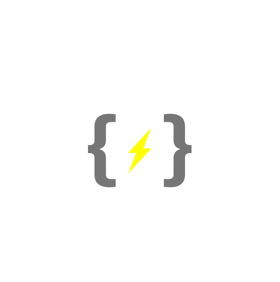

# PPEAgentDeployment



The PPEAgentDeployment project provides a streamlined way to configure and deploy the PPEAgent on a Kubernetes cluster using Ansible playbooks. Here’s an in-depth guide based on the provided project details.

## Overview

**PPEAgentDeployment** simplifies the deployment of PPEAgent, a tool designed for Kubernetes clusters. This solution leverages Ansible for configuration management and Helm for Kubernetes package management. Below, we outline the key steps and configurations needed to get started.

## Prerequisites

Before deploying PPEAgent, ensure you have the following prerequisites in place:

- **Ansible**: A configuration management tool to automate software provisioning.
- **Kubernetes Cluster**: A running Kubernetes cluster where the PPEAgent will be deployed.
- **Helm**: A package manager for Kubernetes to manage Helm charts.

## Installation

### 1. Clone the Repository

Start by cloning the PPEAgentDeployment repository. This will download the necessary files and folders for deployment.

```bash
git \
    clone \
    --branch=master \
    --depth=1 \
    https://github.com/kamilrybacki/PPEAgentDeployment.git
```

### 2. Navigate to the Repository

Change your current directory to the cloned repository to access the deployment files.

```bash
cd PPEAgentDeployment
```

### 3. Configure Environment Variables

Set the required variables in the `group_vars` directory of Your target environment. This directory contains environment-specific configurations.

By default You need two things set up:

- `ppeagentdeployment_namespace` - Namespace to deploy PPEAgent to (set in the `group_vars/ppeagent.yml` file).

    ```yaml
    # Example: Edit development/group_vars/ppeagent.yml
    ppeagentdeployment_namespace: "ppeagent"  # Replace with your target namespace
    ```

- `PPE_AGENT_EMAIL` and `PPE_AGENT_PASSWORD` - Email and password for the PPEAgent service, set in the environment variables, corresponding to Your credentials in [*MójLicznik*] service.

    ```bash
    export PPE_AGENT_EMAIL="oscar@astora.com"
    export PPE_AGENT_PASSWORD="estusflask"
    ```

### 4. Deploy PPEAgent

Run the Ansible playbook to deploy PPEAgent. Replace `<ENVIRONMENT NAME>` with the appropriate environment directory name from `environments/`.

```bash
ansible-playbook \
    --inventory \
        ./environments/<ENVIRONMENT NAME>/ \
    install.yml
```

### 5. Uninstall PPEAgent

To remove the deployed PPEAgent, execute the `uninstall.yml` playbook.

```bash
ansible-playbook \
    --inventory \
        ./environments/<ENVIRONMENT NAME>/ \
    uninstall.yml
```

## Usage

After deploying PPEAgent, you can access the service by visiting
the URL provided in the output of the playbook **if** the Ingress resource
was created and the cluster is accessible from the host machine via FQDNs of the
Ingress resources.

If not - you must [port-forward the service manually] to
access it from the host machine.

## Configuration

### Global variables

**Convention**: Global variables are prepended only with the playbook name i.e.
`ppeagentdeployment_` and are to be set in the `group_vars` directory
of the environment you want to deploy to.

The playbook uses the following playbook-wide variables:

- (**REQUIRED**) `ppeagentdeployment_namespace` - Namespace to deploy PPEAgent to
- `ppeagentdeployment_email` - Email address for the PPEAgent service (default: the value of `PPE_AGENT_EMAIL` environment variable)
- `ppeagentdeployment_password` - Password for the PPEAgent service (default: the value of `PPE_AGENT_PASSWORD` environment variable)
- `ppeagentdeployment_api_version` - Version of the PPEAgent API to deploy (default: `v1`)
- `ppeagentdeployment_kubeconfig` - Path to the `kubectl` configuration file (default: `$HOME/.kube/config`)
- `ppeagentdeployment_cluster_domain` - Cluster domain (default: read from cluster information dump (via service issuer) module or `cluster.local` if not found)

The defaults for these variables are set in the `group_vars/ppeagent.yml` file.

### Role-specific variables

**Convention**: Role variables are prepended with the playbook name followed by the role name and separated by an underscore i.e. `ppeagentdeploment_<ROLE>_`.
Their default values are to be stored in the `roles/<ROLE>/defaults/main.yml` file.
Any internal variables used in the roles are prepended with an underscore and located in the `roles/<ROLE>/vars/main.yml` file. By internal variables, we mean variables that are not meant to be set by the user but are used internally by the role.

However, nothing stops you from setting these variables in the `group_vars` directory of the environment you want to deploy to or in any other way you see fit.
Just bear in ming that they are not a part of "public" API of the playbook.

Each role is responsible for a specific part of the deployment process and
contains a set of tasks that need to be executed.

### [`deploy`] - Deploys the standalone PPEAgent service

| Variable Name                                        | Description                                                                             | Default Value                                          |
|------------------------------------------------------|-----------------------------------------------------------------------------------------|--------------------------------------------------------|
| `ppeagentdeployment_deploy_port`                    | The port on which the PPEAgent service will listen.                                     | `8080`                                                 |
| `ppeagentdeployment_deploy_replica_count`           | The number of replicas for the PPEAgent service.                                        | `1`                                                    |
| `ppeagentdeployment_deploy_custom_config_file`      | Path to a custom configuration file for the PPEAgent service.                           | `""` (empty string, meaning no custom config by default)|
| `ppeagentdeployment_deploy_ingress_enabled`         | Indicates whether Ingress is enabled for the PPEAgent service.                          | `"yes"`                                                |
| `ppeagentdeployment_deploy_ingress_class`           | Specifies the Ingress class to be used.                                                 | `"nginx"`                                              |
| `ppeagentdeployment_deploy_ingress_path`            | The path pattern for Ingress routing.                                                   | `"/{{ ppeagentdeployment_api_version }}(/\|$)(.*)"`     |
| `ppeagentdeployment_deploy_ingress_annotations`     | Annotations to be applied to the Ingress resource.                                      | See below for default annotations                      |
| `ppeagentdeployment_deploy_ingress_routes`          | Defines the Ingress routes, including paths and service settings.                       | See below for default routes                           |
| `ppeagentdeployment_deploy_ingress_enable_tls`      | Indicates if TLS should be enabled for the Ingress.                                     | `"yes"`                                                |
| `ppeagentdeployment_deploy_ingress_tls_secret_name` | The name of the TLS secret to be used by the Ingress.                                   | `""` (empty string, meaning no TLS secret by default)  |
| `ppeagentdeployment_deploy_ingress_tls_hosts`       | Hosts for which TLS should be enabled.                                                  | `["{{ _ppeagentdeployment_deploy_ingress_host }}"]`   |

### Default Annotations for `ppeagentdeployment_deploy_ingress_annotations`

- `key: "nginx.ingress.kubernetes.io/rewrite-target"`
  `value: "/$2"`
- `key: "nginx.ingress.kubernetes.io/use-regex"`
  `value: "true"`

### Default Routes for `ppeagentdeployment_deploy_ingress_routes`

- `path: "/{{ ppeagentdeployment_api_version }}(/|$)(.*)"`
  `serviceName: "{{ _ppeagentdeployment_deploy_service_name }}"`
  `servicePort: "{{ ppeagentdeployment_deploy_port }}"`

To see values for internal variables used in the roles (underscored variables), please refer to the [`vars/main.yml`] file in the role's directory.

[*MójLicznik*]: https://mojlicznik.energa-operator.pl/
[port-forward the service manually]: https://kubernetes.io/docs/tasks/access-application-cluster/port-forward-access-application-cluster/
[`vars/main.yml`]: ./roles/deploy/vars/main.yml
